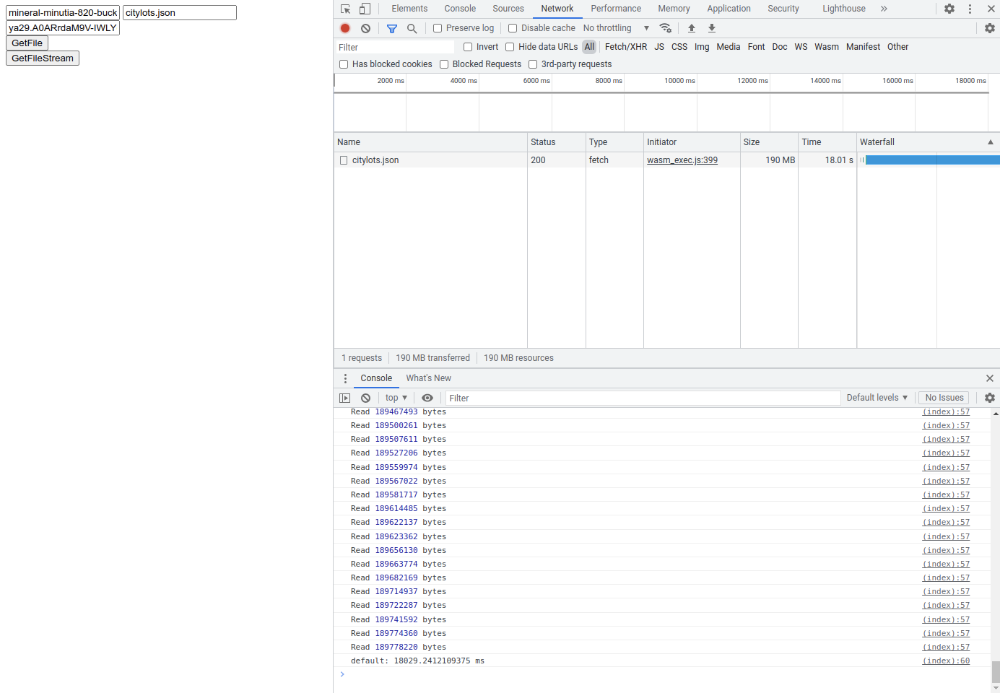

## Browser WebAssembly with Google Storage golang client library

Earlier today I realized go's wasm `net/http` client actually uses javascript `fetch()` internally. so what?

What that means is you can just write some go code, use its default `httpClient` and pipe the output back even as a stream back to the browser.

This is really unexpected and I've detailed the basic flow here:

* [Browser WebAssembly with golang http client](https://blog.salrashid.dev/articles/2022/wasm_http_go/)

This article builds on top of that but instead of a simple web resource, i thought to bake in the full [Google Cloud Storage Client Library](https://cloud.google.com/storage/docs/reference/libraries#client-libraries-install-go) into `wasm`.

Since the GCS client library currently uses REST/HTTP (not gRPC) and that uses the underlying httpClient....why not see if i can use gcs-go in browser webassembly?

If i could do that, then i can "just use" the client library to upload and download files as long as credentials are somehow passed to the client.

eg do this in wasm in the browser

```golang
client, err := storage.NewClient(ctx, option.WithTokenSource(ts))
bkt := client.Bucket(bucketName)
obj := bkt.Object(fileName)
r, err := obj.NewReader(ctx)
```

fastforward, thats what this article shows

---

So lets get started...

#### Setup

Clone and compile the wasm binary yourself:

```bash
git clone https://github.com/salrashid123/wasm_http_gcs_go
cd wasm_http_gcs_go

GOOS=js GOARCH=wasm go build -o  server/static/wasm/main.wasm  main.go
```

The webserver i use here to host the 'site' uses the certificate SNI name of `gcs.somedomain.com`.

So lets setup a local redirect for that in `/etc/hosts`

```bash
127.0.0.1 gcs.somedomain.com
```

At this point, lets setup a GCS Bucket and upload a small test file

```bash
export PROJECT_ID=`gcloud config get-value core/project`
export PROJECT_NUMBER=`gcloud projects describe $PROJECT_ID --format='value(projectNumber)'`

echo -n '{"a":"b", "c":"d"}' > foo.json

gsutil mb gs://PROJECT_ID-bucket/
gsutil cp foo.json gs://PROJECT_ID-bucket/
```

Since we're dealing with javascript we need to setup CORS on this bucket

```bash
gsutil cors set cors.json gs://$PROJECT_ID-bucket


## Test CORS

curl -v -X OPTIONS -H "Host: storage.googleapis.com" -H "Access-Control-Request-Method: GET" \
    -H "Origin: https://gcs.somedomain.com:8080" \
    "https://storage.googleapis.com/$PROJECT_ID-bucket/file.json"
```

ok, now start the webserver

```bash
cd server
go run server.go
```

get your current access token

```bash
gcloud auth print-access-token
```

In an incognito, goto [https://gcs.somedomain.com:8080/static/](https://gcs.somedomain.com:8080/static/)

Ignore the certs warning

enter in your `bucketName` and `access_token` (again, the wasm isnt' doing anything with your token, see the section in the appendix!)


---

### Appendix

#### Credentials

This sample expects you to provide webassembly your `access_token`.  Why?  well, it needs that to access the object you're going to upload.  

The code is provided in this repo and as you can see, it doens't do anything other than utilize the client library itself (you can see the source and the `go.mod` for yourself!)

Your users will not be expected to copy-paste in the token..It could be provided through oauth2 single-page app webflow (though there's real significant issue of `scopes`...which makes this not a good idea)

Better way would be if the `access_token` is provided to the client/browser through an external system which possibly already setup a [DownScoped credentials](https://cloud.google.com/iam/docs/downscoping-short-lived-credentials).

The issue of how the user gets the token in the browser isn't covered here in this article. 


#### Larger files

We used a really small file here.  To test with larger files, download something like the `citylogs.json` file (about 180MB)


```bash
wget https://raw.githubusercontent.com/zemirco/sf-city-lots-json/master/citylots.json
```

Then upload and test.  But before you do, stop the server, edit `index.html` to not render it all in the browser (that'll cause the browser to crash!)

```javascript
	async function GetFile(bucket, file, token) {
		try {
			console.time();
			const response = await GetGCSFile(bucket, file, token)
			const message = await response.json()
			console.timeEnd();
		} catch (err) {
			console.error('Caught exception', err)
		}
	}

	async function GetFileStream(bucket, file, token) {
		try {
			console.time();
			const response = await GetGCSFileStream(bucket, file, token)
			const reader = response.body.getReader()
			let done = false
			let totalBytes = 0;
			while (!done) {
				const read = await reader.read()
				done = read && read.done
				if (read.value) {
					totalBytes = totalBytes + read.value.length;
					console.log('Read', totalBytes, 'bytes')
				}
			}
			console.timeEnd();
		} catch (err) {
			console.error('Caught exception', err)
		}
	}
```

Once you restart the server, hard-refresh the browser and test again.  Remember to click  the `GetFileStream` endpoint

For me, on my crappy `verizon` connection, download the citylots.json file took about `17.8s` using `gsutil`

```bash
time gcloud alpha storage cp gs://$PROJECT_ID-bucket/citylots.json .

Average throughput: 10.8MiB/s

real	0m17.865s
user	0m2.348s
sys	0m1.943s
```

and on the browser, the same amount of time, `18s`



I also benchmarked `1.7G` file which actually took the same here on my crappy connection: `2.6mins`


#### TinyGo

As mentioned in the original article, its preferable to use TinyGo instead.

Using the default go-binary creates a fairly large file:


```bash
GOOS=js GOARCH=wasm go build -o  server/static/wasm/main.wasm  main.go
$ ls -larth server/static/wasm/main.wasm 
    20M Mar 21 14:48 server/static/wasm/main.wasm
```